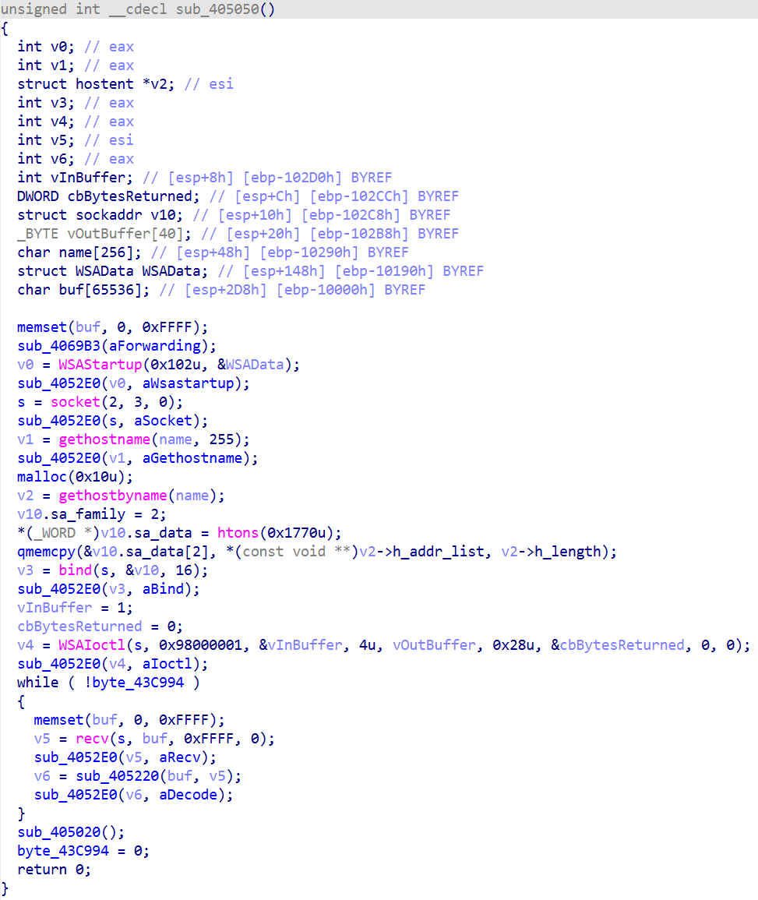
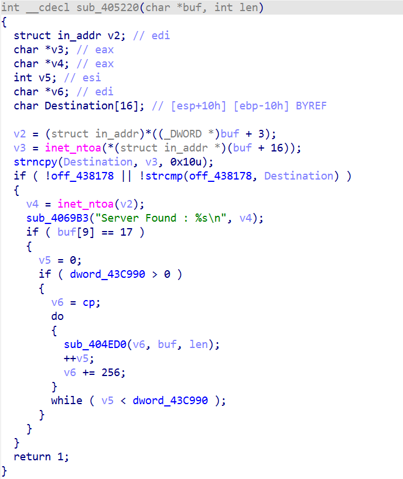
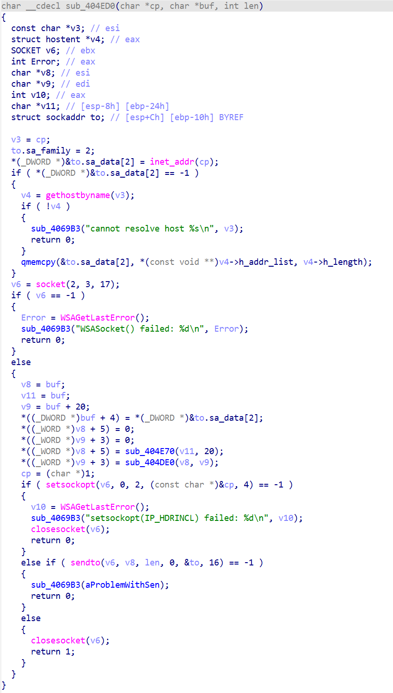

# Battle.LAN 내부 동작 분석: SIO_RCVALL과 가상 LAN 구현

## 개요

Battle.LAN은 서로 다른 물리적 네트워크에 위치한 사용자들이 마치 같은 로컬 LAN에서 게임을 하는 것처럼 연결할 수 있게 해주는 프로그램입니다.

본 문서에서는 이 프로그램의 내부 동작 방식을 분석하고, 그 원리를 바탕으로 구현한 내용을 정리합니다.

## 내부 동작 분석

### 1. 패킷 스니핑 설정

프로그램의 Start 버튼을 누르면 다음 코드가 실행됩니다.

`WSAIoctl` 함수는 소켓의 동작 모드를 제어하는 Windows API입니다. 두 번째 인자로 전달되는 `0x98000001`은 **SIO_RCVALL** (SIO Receive All) 제어 코드로, 이 코드를 사용하면 해당 소켓이 네트워크 인터페이스를 통과하는 모든 패킷을 수신할 수 있게 됩니다.

이를 통해 프로그램이 패킷 스니핑을 수행한다는 것을 확인할 수 있습니다. 다음으로는 스니핑한 패킷을 어떻게 처리하는지 살펴보겠습니다.

### 2. 패킷 필터링 및 전송

스니핑한 패킷은 다음과 같이 처리됩니다. 먼저 패킷 버퍼를 필터링하여 특정 조건을 만족하는 패킷만 선택합니다. 조건을 만족하는 패킷의 경우, `socket(AF_INET, SOCK_RAW, IPPROTO_UDP)`를 사용하여 RAW 소켓을 생성하고, `IP_HDRINCL` 옵션을 `TRUE`로 설정합니다.

`IP_HDRINCL` 옵션을 활성화하면 IP 헤더를 직접 작성하고 수정할 수 있게 됩니다. `setsockopt` 호출 이전의 코드를 보면, 이 옵션이 필요한 이유를 알 수 있습니다. 프로그램은 패킷 버퍼의 내용을 수정한 후 `sendto` 함수를 통해 전송합니다.

코드 분석 결과, `IPHeader`의 Destination Address와 패킷의 체크섬을 수정하는 것을 확인했습니다.

패킷을 정상적으로 전송하려면 **IP 헤더 체크섬(IP checksum)**과 **UDP 체크섬(UDP checksum, pseudo-header 포함)**을 올바르게 계산하여 설정해야 합니다.

### 3. 동작 원리 요약

정리하면, Battle.LAN은 다음과 같이 동작합니다:

1. 네트워크 인터페이스를 통과하는 모든 패킷을 스니핑합니다.
2. 특정 조건을 만족하는 패킷을 필터링합니다.
3. 필터링된 패킷의 IP 헤더를 수정하여 Receivers 목록에 등록된 주소들로 전송합니다.

이를 통해 서로 다른 네트워크에 있는 사용자들이 마치 같은 LAN에 있는 것처럼 게임을 플레이할 수 있게 됩니다.

